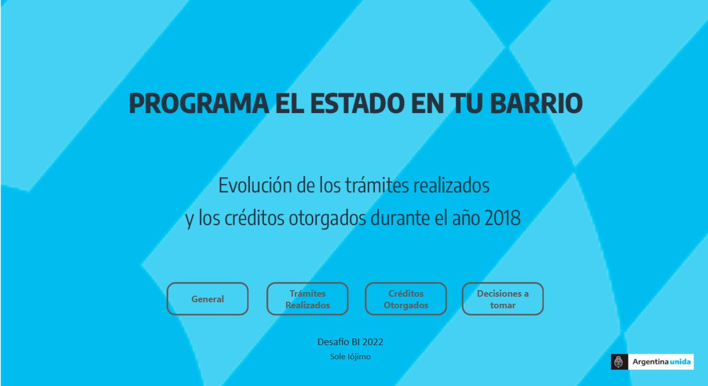
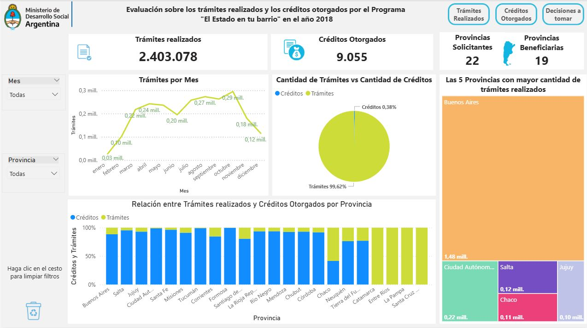
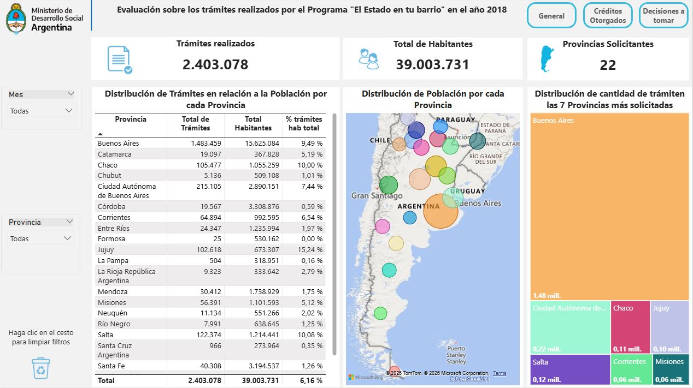
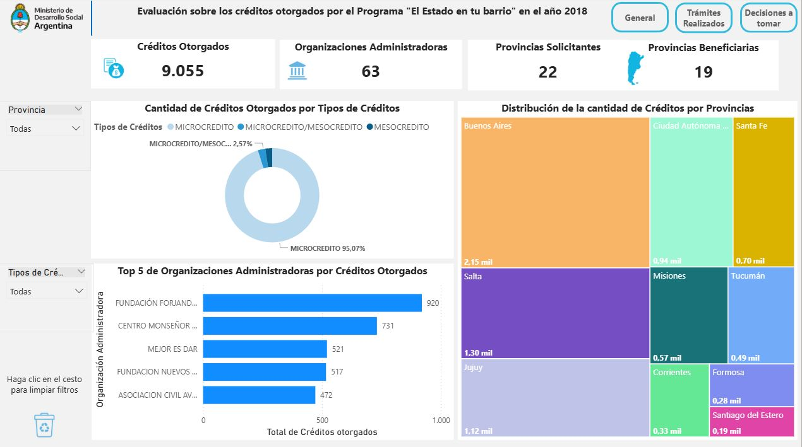
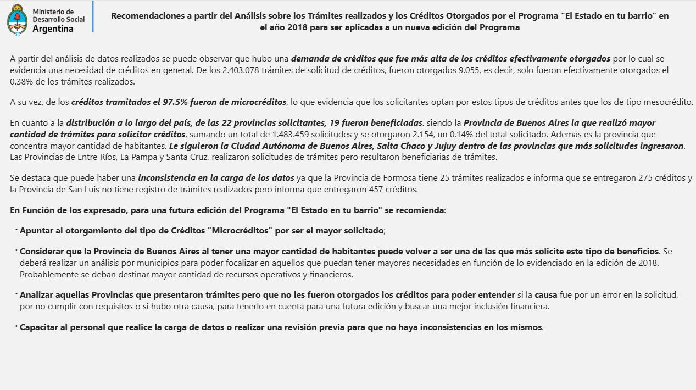

# Desafío BI – El Estado en tu Barrio

## Análisis del programa "El Estado en tu Barrio"

Este proyecto analiza el programa "El Estado en tu Barrio" utilizando datos públicos, con el objetivo de identificar provincias prioritarias de intervención y evaluar la relación entre la demanda de trámites y el otorgamiento de microcréditos.

---

## Objetivo del análisis

- Identificar provincias con mayor necesidad de atención  
- Analizar la relación entre trámites realizados y créditos otorgados  
- Evaluar la incorporación del trámite "Microcréditos" dentro del programa  
- Proponer decisiones para mejorar la implementación futura  

---

## Enfoque del análisis

El análisis se centra en entender:

- cómo se distribuyen los trámites a nivel país  
- qué provincias concentran mayor demanda  
- qué proporción de esa demanda se convierte en créditos otorgados  
- cómo se relaciona la cantidad de trámites con los microcréditos  

---

## Decisiones que habilita este análisis

A partir de los datos, es posible:

- Detectar provincias con alta demanda y baja cobertura  
- Identificar oportunidades de mejora en la asignación de recursos  
- Evaluar la relevancia del otorgamiento de microcréditos  
- Detectar inconsistencias en la carga de datos  
- Priorizar acciones para futuras ediciones del programa  

---

## Principales hallazgos

- Existe una **alta demanda de créditos** en relación a los otorgados.  
- Solo el **0,38% de los trámites se traduce en créditos otorgados** . 
- El **97,5% de los créditos solicitados corresponden a microcréditos**, evidenciando una fuerte preferencia por este tipo.  
- La **Provincia de Buenos Aires concentra la mayor cantidad de solicitudes**, en línea con su población.  
- Se detectaron **inconsistencias en los datos**, como provincias con créditos otorgados sin registros de trámites.  

---

## Recomendaciones

A partir del análisis realizado, se propone para una segunda etapa:

- Priorizar el otorgamiento de **microcréditos**.  
- Focalizar recursos en provincias con mayor demanda, como Buenos Aires.  
- Analizar provincias con solicitudes sin créditos otorgados para identificar causas.  
- Incorporar controles de calidad en la carga de datos.  

---

## Modelado de datos

El modelo se construye a partir de datos abiertos:

- Trámites realizados por provincia  
- Créditos otorgados por organizaciones  
- Población por provincia  

Se integran para permitir:

- análisis por provincia  
- normalización por cantidad de habitantes  
- comparación entre demanda y otorgamiento  

---

## Métricas clave

- Total de trámites  
- Total de créditos otorgados  
- % de créditos sobre trámites  
- % de trámites sobre población  
- Cantidad de provincias solicitantes y beneficiarias  

---

## Vista previa

### Portada

### General

### Trámites realizados

### Créditos otorgados

### Decisiones

---

## Documentación

Este proyecto cuenta con documentación detallada sobre el análisis, modelado y métricas utilizadas.

[Acceder a la documentación completa](https://docs.google.com/document/d/1wXzlDU6MvnkaFTegOG3o7uGBpqE7Y6ZDVj4v9F7STfs/edit?usp=sharing)
[Acceder al video demo](https://drive.google.com/file/d/1jMegmQWLnnxgSZgAugKEZsZQb2uymYky/view?usp=sharing)

---

## Autor

Sole Iójimo  
Data Analyst | Business Intelligence